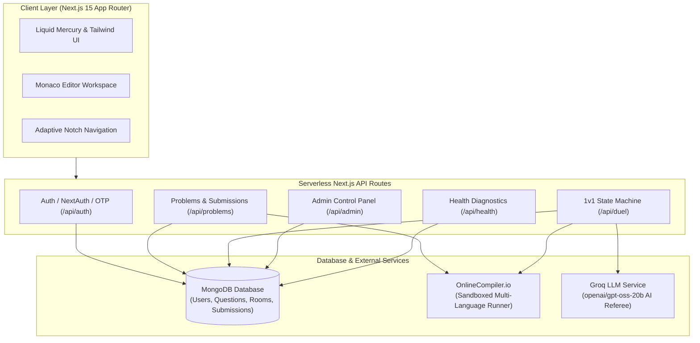

<div align="center">
  <h1>⚔️ ClashJudge</h1>
  <p><strong>The Real-Time Competitive Coding Arena & Practice Platform Powered by AI Qualitative Refereeing</strong></p>

  <p>
    <a href="#-features">Features</a> •
    <a href="#-architecture">Architecture</a> •
    <a href="#-quick-start">Quick Start</a> •
    <a href="#-tech-stack">Tech Stack</a> •
    <a href="#-api-endpoints">API Endpoints</a> •
    <a href="#-license">License</a>
  </p>

  
  
  
  
  
</div>

---

## ⚡ Overview

**ClashJudge** is a modern competitive coding platform and practice environment designed for rapid algorithmic growth and high-stakes 1v1 developer battles.

It marries the deep engineering and practice workflow of competitive platforms with an **authoritative AI Referee** powered by Groq (`openai/gpt-oss-20b`). Instead of merely checking whether a solution passed standard tests, the AI Referee inspects code readability, algorithmic complexity, architectural elegance, and edge-case handling to deliver granular critique, mistakes analysis, and color commentator verdicts.

---

## 🚀 Key Features

### ⚔️ 1. Competitive 1v1 AI-Refereed Duels
- **Server-Authoritative Match Lifecycle**: Finite state machine (`WAITING` $\to$ `ACTIVE` $\to$ `JUDGING` $\to$ `FINISHED`) synchronized in real time.
- **Fair Anti-Cheat Isolation**: Opponent code is strictly withheld by the server until both players submit or the countdown expires.
- **Deterministic Resolution & Elo Calculation**:
  1. Primary: Hidden test suite passing percentage
  2. Secondary: Wall-clock execution runtime
  3. Tertiary: Groq AI qualitative readability and complexity score
- **Reconnection & Refresh Resilience**: Instant state reconstruction from server on page reload or direct link entry.

### 💻 2. Practice Mode & Problem Studio
- **Monaco Code Editor**: VS Code-grade editing with syntax highlighting, auto-formatting, keyboard shortcuts, and full language support.
- **Multi-Language Runtime Support**:
  - 🐍 Python (3.14)
  - ⚡ JavaScript (Node.js / Deno)
  - 🚀 C++ (g++-15, C++23)
  - ☕ Java (OpenJDK 25)
  - ⚙️ C (gcc-15, C23)
- **Local Draft Persistence**: Never lose work—in-progress solutions are saved automatically to local storage per problem & language.
- **Submission History**: Inspect previous submissions with runtime metrics, memory usage, and execution status.

### 🧠 3. Groq Qualitative AI Referee
- Structured output evaluation providing:
  - **Readability Score**: 1 to 10 rating based on idiomatic idioms and clean structure.
  - **Coaching Diagnostics**: Specific logic flaws, antipatterns, and micro-optimizations.
  - **Better Approaches**: Hints for alternative algorithmic approaches (e.g., $O(N)$ hash tables vs $O(N^2)$ brute force).
  - **Commentator Verdict**: Engaging, concise commentary summarizing how the match was won or lost.

### 🔐 4. Modern Authentication & Compliance
- **Google OAuth 2.0 & Passwordless OTP**: Sign in with single-click OAuth or instant 6-digit email OTPs.
- **Full Legal Compliance**: Built-in Privacy Policy (`/privacy`), Terms of Service (`/terms`), Cookie Policy (`/cookies`), and consent management banners.
- **NoSQL Injection Defense**: Strict string primitive coercion prevents query operator injection attacks.

### 🛡 5. Administrative Command Center (`/admin`)
- **System KPIs**: Live counts of registered developers, total submissions, active duels, and pass rates.
- **User Management**: Search users, monitor Elo rankings, and toggle admin privileges.
- **Problem Studio**: Create, edit, and curate coding problems with public and hidden test cases.
- **Duel Room Inspector**: Real-time monitor for ongoing and completed competitive matches.

---

## 🏗 Architecture



---

## 🛠 Tech Stack

- **Framework**: [Next.js 15 (App Router)](https://nextjs.org/)
- **Language**: [TypeScript 5](https://www.typescriptlang.org/)
- **Styling**: [Tailwind CSS](https://tailwindcss.com/), [Framer Motion](https://www.framer.com/motion/), [Lucide Icons](https://lucide.dev/)
- **Editor**: [@monaco-editor/react](https://github.com/suren-atoyan/monaco-react)
- **Database**: [MongoDB](https://www.mongodb.com/) via [Mongoose](https://mongoosejs.com/)
- **Authentication**: [NextAuth.js v5 / Auth.js](https://authjs.dev/) + Custom Email OTP
- **AI Referee**: [Groq Cloud](https://groq.com/) (`openai/gpt-oss-20b`)
- **Code Execution Engine**: [OnlineCompiler.io](https://onlinecompiler.io/)

---

## 🏁 Quick Start

### 1. Clone the repository
```bash
git clone https://github.com/your-username/clashjudge.git
cd clashjudge
```

### 2. Install dependencies
```bash
npm install
```

### 3. Setup environment variables
Copy the template to `.env.local`:
```bash
cp .env.example .env.local
```
Edit `.env.local` with your database URI and API keys:
```env
AUTH_SECRET="your-auth-secret-key"
MONGODB_URI="mongodb://127.0.0.1:27017/clashjudge"
ONLINECOMPILER_API_KEY="your-onlinecompiler-api-key"
GROQ_API_KEY="your-groq-api-key"
```

### 4. Seed problem library
```bash
npx tsx scripts/seed.ts
```

### 5. Launch the development server
```bash
npm run dev
```
Open [http://localhost:3000](http://localhost:3000) to start coding.

---

## 📡 API Endpoints

| Endpoint | Method | Description |
|---|---|---|
| `/api/health` | `GET` | Health check, latency diagnostics & service status |
| `/api/problems` | `GET` | Paginated problems catalog with search & tag filtering |
| `/api/problems/[id]` | `GET` | Safe problem details with public test cases |
| `/api/problems/run` | `POST` | Execute custom test cases against sandboxed runner |
| `/api/problems/submit` | `POST` | Grade code against hidden suite & record submission |
| `/api/duel/create` | `POST` | Create a new 1v1 duel room |
| `/api/duel/join` | `POST` | Join an existing duel room by code |
| `/api/duel/[roomCode]` | `GET` | Authoritative duel room state (with anti-cheat masking) |
| `/api/duel/[roomCode]/submit`| `POST` | Submit player solution during match |
| `/api/duel/[roomCode]/judge` | `POST` | Finalize match, run AI Referee critique & update ratings |
| `/api/admin/overview` | `GET` | Platform KPIs & statistics |
| `/api/admin/users` | `GET`, `PATCH` | User management & role promotion |
| `/api/admin/problems` | `GET`, `POST` | Problem studio creator & inspector |
| `/api/admin/duels` | `GET` | Live and archived duel match inspector |

---

## 📄 License

This project is licensed under the [MIT License](LICENSE).
# builtintech

