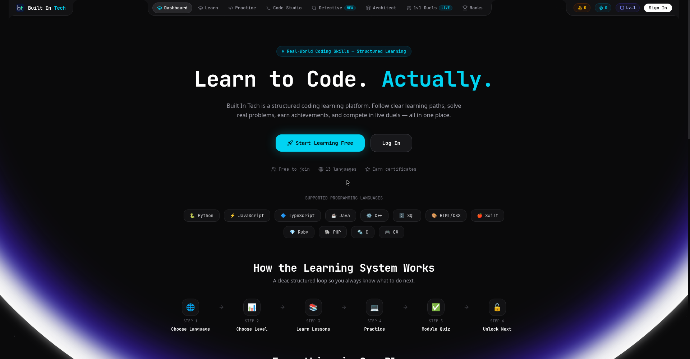

<div align="center">
  <h1>builtintech</h1>
  <p><strong>CodeForge: a gamified coding learning platform with AI-refereed 1v1 duels</strong></p>

  <p>
    <a href="#features">Features</a> •
    <a href="#architecture">Architecture</a> •
    <a href="#quick-start">Quick Start</a> •
    <a href="#tech-stack">Tech Stack</a> •
    <a href="#license">License</a>
  </p>

  
  
  
  
</div>

<div align="center">
  
</div>

---

## Overview

**builtintech** (CodeForge) is a gamified platform for learning to code, built at the KJU Hacktoberfest Hack Day 2026. It combines interactive coding lessons with competitive 1v1 duels.

Learn a language through bite sized concepts, hands on exercises, and quizzes that gate your progress. Then test your skills in live duels where an AI referee judges both solutions on correctness, efficiency, and readability, and delivers a commentator style verdict.

Supported languages: Python, HTML, CSS, JavaScript, SQL, Java, C, C++, C#, PHP, TypeScript, Swift, Ruby.

## Features

### Learn mode
- Skill level picker: beginner, intermediate, or advanced per language
- Concept lessons with notes and syntax highlighted examples
- Interactive exercises: write code in the editor or drag and drop blocks into the right order
- Code execution visualizer: step through code line by line and watch variables change
- End of concept quizzes: you must answer every question correctly to unlock the next concept, wrong answers show what went wrong
- Profile page: track completed languages, collect achievements, view earned certificates
- Downloadable certificate on completing a language

### Duel mode
- Create a room, share the link, race an opponent on the same problem
- Monaco code editor with multi language execution
- Server side hidden test cases neither player can see
- Groq AI referee scores correctness, efficiency, and readability, then declares a winner with commentary

## Architecture

```
Client (Next.js 16 App Router)
  -> API routes (/api/problems, /api/duel)
    -> OnlineCompiler.io (sandboxed code execution)
    -> Groq (openai/gpt-oss-20b AI referee)
    -> MongoDB via Mongoose (users, problems, progress)
  -> NextAuth (Google OAuth sign-in)
```

## Tech Stack

- **Framework**: [Next.js 16 (App Router)](https://nextjs.org/)
- **Language**: [TypeScript 5](https://www.typescriptlang.org/)
- **Styling**: [Tailwind CSS 4](https://tailwindcss.com/), [Framer Motion](https://www.framer.com/motion/), [Lucide Icons](https://lucide.dev/)
- **Editor**: [@monaco-editor/react](https://github.com/suren-atoyan/monaco-react)
- **Auth**: [NextAuth](https://next-auth.js.org/) with Google OAuth
- **Database**: [MongoDB](https://www.mongodb.com/) with [Mongoose](https://mongoosejs.com/)
- **AI Referee**: [Groq Cloud](https://groq.com/) (openai/gpt-oss-20b)
- **Code Execution**: [OnlineCompiler.io](https://onlinecompiler.io/)

## Quick Start

### Prerequisites
- Node.js v20+
- MongoDB v6.0+ running locally on port `27017`, or a MongoDB Atlas connection string

### 1. Clone the repository
```bash
git clone https://github.com/p3xz/builtintech.git
cd builtintech
```

### 2. Install dependencies
```bash
npm install
```

### 3. Set up environment variables
```bash
cp .env.example .env.local
```
Fill in your keys in `.env.local`:
```env
# Auth (generate AUTH_SECRET via `openssl rand -base64 32`)
AUTH_SECRET=your-auth-secret
NEXTAUTH_URL="http://localhost:3000"

# Database
MONGODB_URI="mongodb://127.0.0.1:27017/builtintech"

# Google OAuth (mandatory — sign-in is Google only)
GOOGLE_CLIENT_ID="your-google-client-id.apps.googleusercontent.com"
GOOGLE_CLIENT_SECRET="your-google-client-secret"

# Code execution + AI referee
ONLINECOMPILER_API_KEY=your-onlinecompiler-api-key
GROQ_API_KEY=your-groq-api-key
```

### 4. Seed the problem database
```bash
npm run seed
```
Without this step the Learn and Duel problem lists will be empty.

### 5. Run the dev server
```bash
npm run dev
```
Open [http://localhost:3000](http://localhost:3000).

## Team

Built by team Phoenixfy and collaborators at Kristu Jayanti University, Hacktoberfest Hack Day 2026.

## License

This project is licensed under the [MIT License](LICENSE).
